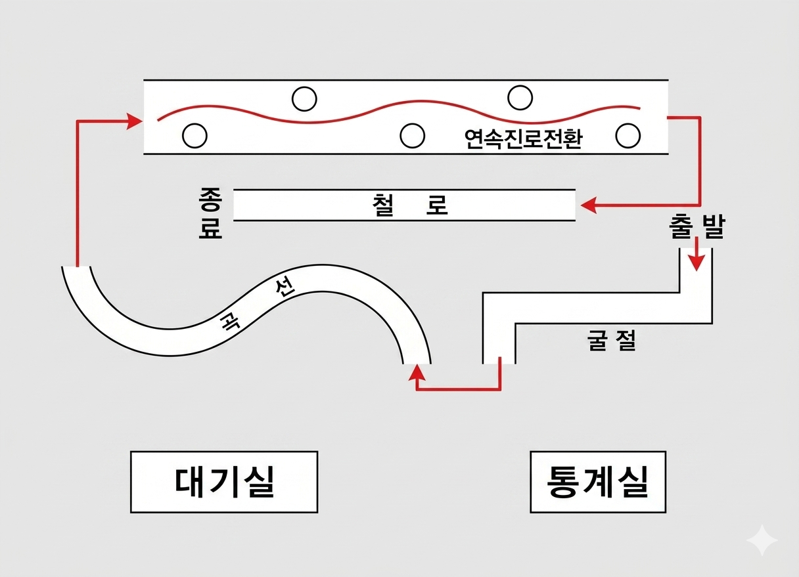

<!DOCTYPE html>
<html lang="en">
<head>
    <meta charset="UTF-8">
    <meta name="viewport" content="width=device-width, initial-scale=1.0">
    <title>Personal Portfolio | Adventure Hub</title>
    <link href="https://fonts.googleapis.com/css2?family=Poppins:wght@300;400;600;700&display=swap" rel="stylesheet">
    
</head>
<body class="dark-mode">

    <button id="theme-toggle" title="Toggle Theme">🌓</button>

    

        
        

            

                

                    
                

                

                    <h2>Rider Profile</h2>
                    
Skill Level: 2026 Pro

                    
Status: Licensed In Korea

                    
Hover to inspect

                

            

        

        <h2 class="section-title">Adventures & Insights</h2>

        

            
            

                

                    <h3>Motorcycle License Quest</h3>
                    NEW
                

                
Tackling the "2nd Class Small" functional course at the Seoul Testing Center.

                
                

                

                    

                        💡 New Insights
                    

                    <ul style="list-style: none; font-size: 0.9rem; line-height: 1.6;">
                        <li style="margin-bottom: 8px;">• <strong>The Crank Trick:</strong> The front wheel must almost touch the outer line to clear the inner corner.</li>
                        <li>• <strong>Personal Experience:</strong> [Replace this: Add your story about the test day and the specific bike used!]</li>
                    </ul>
                

            

            

                <h3>Future Project</h3>
                
Adventure details coming soon...

                

                    
🔒 Locked

                    
Complete current quests to unlock.

                

            

        

    

    
</body>
</html>
